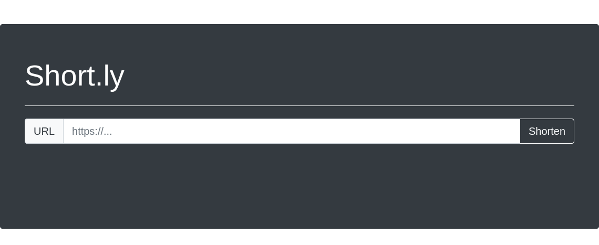
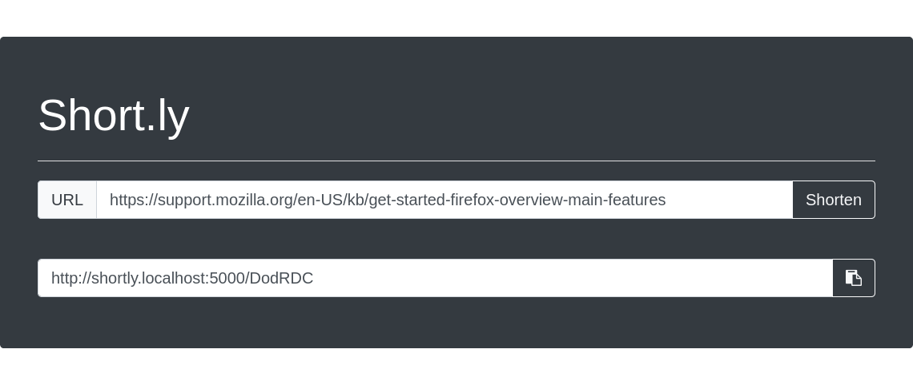

# short.ly
Flask URL shortening service with simple API and sqlite/mysql database backend.




## Run

### Local
```shell script
# install dependencies
python3 -m venv venv
source venv/bin/activate
pip install -r requirements.txt

# run
export FLASK_APP="shortly"
flask init-db
flask run
# OR
gunicorn -b 127.0.0.1:5000 "shortly:create_app()"
```

